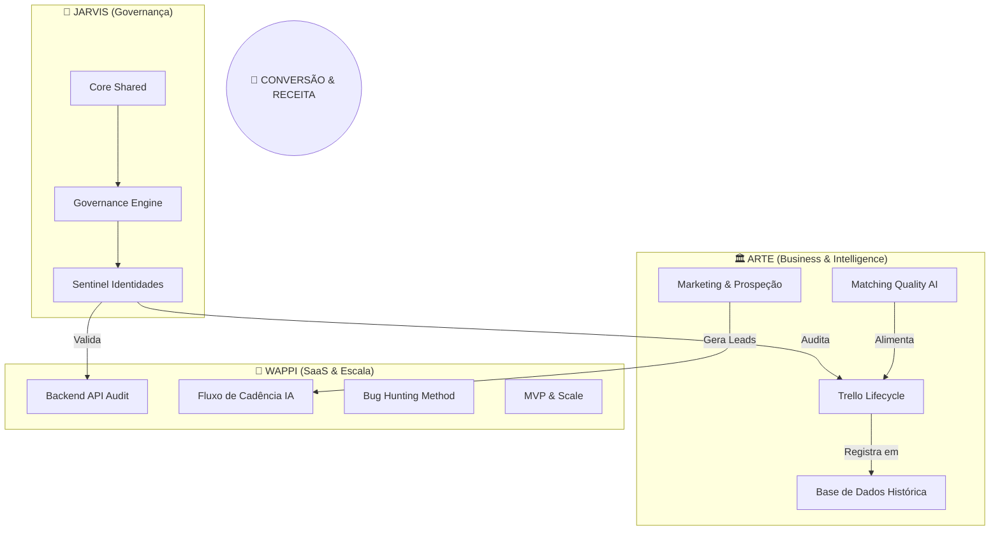

# 🗺️ JARVIS CORE ROADMAP — Missão Controle (v2.0)

Este documento centraliza a estratégia de longo prazo e o racional de execução do ecossistema.

## 🌀 Arquitetura de Interdependência

---

## 🎯 Metas & Metodologias (Q1-Q2 2026)

### 1. 🏗️ JARVIS (Self-Building)
- **Meta 1**: Centralizar 100% dos logs de commits dos projetos Core.
- **Meta 2**: Implementar o "Guided Briefing" no NotebookLM para análise de gaps de código.
- **Meta 3**: Interface localhost Mission Control ativa.

### 2. 🏛️ ARTE (Business Intelligence)
- **Meta 1**: **Qualidade de Matching**: IA com justificativa técnica e jurídica para impugnação.
- **Meta 2**: **Metodologia "Lifecycle"**: Integrar `arte_heavy_ultra.xlsx` ao Trello. Cada card = uma licitação com checklist completo (editais, propostas, esclarecimentos).
- **Meta 3**: **Base Histórica**: XLS de resultados por UASG/Edital, controle de ATAs e Estoque.
- **Meta 4**: **Ecossistema de Vendas**: Loja de ATAs, E-mail/WhatsApp Marketing e Agente de Prospecção.

### 3. 📱 WAPPI (SaaS/Escala)
- **Meta 1**: **Auditoria Total**: 100% de cobertura de endpoints na `backend_api`.
- **Meta 2**: **Fluxo de Cadência**: Definir atuação da IA para máximo de conversões e contato próximo.
- **Meta 3**: **Qualidade & Bug Hunting**: Metodologia de caça a bugs baseada em avaliação humana + Swagger completo.
- **Meta 4**: **Escala MVP**: Logins individuais e controle de credenciais para novos clientes.

---
*Gerenciado pelo JARVIS COS — Última atualização: 27/02/2026*
