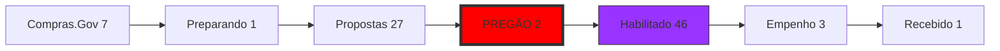

# 🗺️ JARVIS DATA-VIZ KIT (v1.0)

Este kit define o padrão visual para nossos dashboards e relatórios conversacionais. Use estes componentes para manter a "iconização" e a fluência visual.

## 🏗️ 1. Componentes de Pipeline (ARTE / Business)

### 📊 ARTE: Pipeline de Licitações

- 🔴 **CRÍTICO AGORA**: 2 Pregões em andamento.
- 🟣 **GARGALO**: 46 Habilitações (Acompanhamento necessário).
- 🏆 **HISTÓRICO**: 71 Ganhas | 319 Perdidas | 116 Descartadas.

---

## 🚀 2. Componentes de Projeto (WAPPI / Dev)

### ⚡ WAPPI: Status de Escala
- **Progress**: `[▓▓▓░░░░░░░] 30%`
- **Objective**: Bridge Conversacional Standalone.
- **Competências Necessárias**:
    - 🛠️ Node.js (OpenClaw)
    - 🔌 WebSocket API
    - 📱 WhatsApp Baileys MD

> [!TIP]
> **Sugestão JARVIS**: Foque em subir o Docker na Máquina B primeiro para isolar o ambiente.

---

## 🧘 3. Componentes de Vida Pessoal (Energy & Body)

### 🔋 Bio-Dash
- **Energia**: `[▓▓▓▓▓▓▓░░░] 70%`
- **Treino do Dia**: 🧊 Crioterapia + 🏋️ Musculação
- **Foco Mental**: 🧠 Profundo (Deep Work)

---

## 🎨 4. Paleta Iconizada JARVIS

| Ícone | Significado | Aplicação |
| :--- | :--- | :--- |
| 🚀 | Vetor 10x | Projetos em tração |
| ⚠️ | Risco | Licitações vencendo / Bloqueios |
| 🛡️ | Governança | Registro de Brain / Memory |
| 🏆 | Vitória | Ganhos reais (Revenue) |
| 💊 | Pílula | Checkpoint de 30min |

---

## 🛠️ Dashboard de Comandos Rápidos

| Comando | Descrição | Ícone |
| :--- | :--- | :--- |
| `/viz-arte` | Mostra dataframe de Licitações | 📊 |
| `/viz-wappi` | Mostra barra de progresso Dev | ⚙️ |
| `/viz-life` | Mostra status de Energia | 🔋 |
