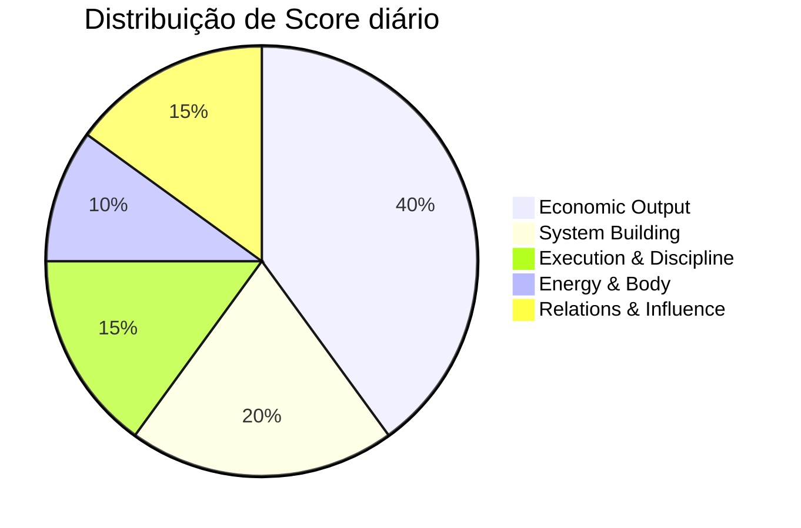
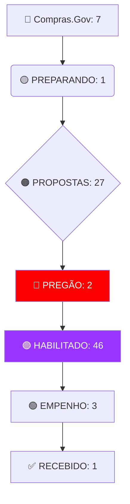

# 🚀 MISSION CONTROL — JARVIS COS

> [!IMPORTANT]
> **STATUS OPERACIONAL**: ATIVO (VETOR 10x)
> **ÚLTIMO SCORE**: 82 (Tendência: 📈 +5%)

## 📊 Dashboard de Performance (Vetor Econômico)

## 📊 Pipeline Ativo — 109 Licitações (ARTE)

### 📈 Métricas de Escala (10x)
## 🧠 Brain & Strategic Sync (10x)

| Métrica | Valor | Status | IA Insight |
| :--- | :--- | :--- | :--- |
| **Cognitive Sync** | 78% | 🟢 Estável | Foco em WAPPI caiu na última hora. |
| **Consistency Rate** | 92% | 🔥 High | Cadência de 30min mantida com sucesso. |
| **Brain Roadmap** | v1.2 | ✅ Sync | Todos os MDs cerebrais sincronizados. |

---

## 🏛️ XP BARSI: Gestão Financeira & CRM
- **Evolution API**: 🟢 Ativo (Script `evolution_monitor.py` em execução).
- **Fluxo Ativo**: Monitorando Grupo BARSI -> Redirecionando p/ Pie.Invest.
- **Trello CRM**: ⏳ Aguardando importação Excel (#TASK).

---

## 📊 Pipeline de Operações & Expansão (ARTE)

- **Metodologia de ATA's**: #TASK - Definir Site & Marketing.
- **Loja B2C**: #TASK - Estruturar 'Loginha da Arte'.

## 🔔 Colaboração & Alertas Ativos

- [ ] **[ULTRA TASK] ARTE**: ⏳ Cronjob ativo para 1º dia útil (Habilitação).
- [ ] **Pílula de Alinhamento**: Pendente (Próxima em 30 min)
- [ ] **Input Monitor**: 📥 Aguardando novos Markdowns em `inputs/`.
- [ ] **Mobile Sync**: Conector OpenClaw (Máquina B) — *Standalone*.

---

## 🛠️ Comandos de Fluxo (Quick-Action)

1.  `/briefing` — Gera o resumo do dia.
2.  `/check-pings` — Verifica gargalos em ARTE/WAPPI/XP BARSI.
3.  `/sync-memory` — Sincroniza logs com o NotebookLM (ou aciona Selenium Contingency).
4.  `/whatsapp-broadcast` — Dispara o ping forçado para o mobile.

---

## 🧠 Brain Location
- [task.md](file:///c:/Users/pietr/OneDrive/.vscode/JARVIS/.jarvis/brain/task.md)
- [daily_operational_protocol.md](file:///c:/Users/pietr/OneDrive/.vscode/JARVIS/.jarvis/brain/daily_operational_protocol.md)
- [core_roadmap.md](file:///c:/Users/pietr/OneDrive/.vscode/JARVIS/.jarvis/brain/core_roadmap.md)
